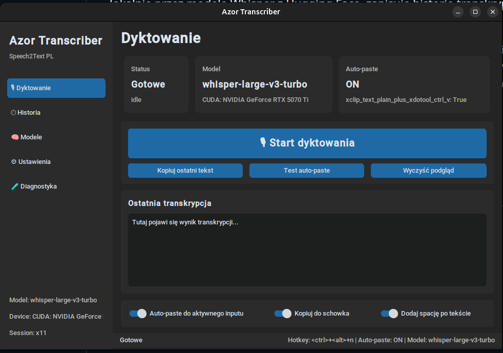
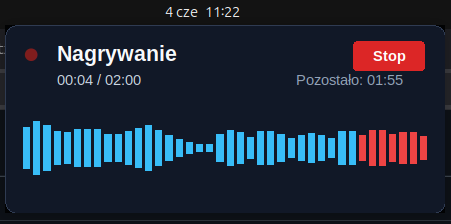

# Azor Transcriber 🎙️

Azor Transcriber to nowoczesna i szybka aplikacja GUI do transkrypcji mowy na tekst w czasie rzeczywistym. Wykorzystuje potężne modele **OpenAI Whisper**, aby zamieniać Twoje słowa w tekst i automatycznie wklejać go tam, gdzie aktualnie piszesz.

Zobacz też: [Changelog](CHANGELOG.md)



## Główne cechy

*   **Błyskawiczna transkrypcja:** Wykorzystuje lokalne modele Whisper (od Tiny do Large v3 Turbo).
*   **Auto-Paste:** Automatycznie wkleja przetworzony tekst do aktywnego okna (edytora tekstu, komunikatora, przeglądarki).
*   **Globalny skrót klawiszowy:** Rozpoczynaj i kończ nagrywanie za pomocą `<Ctrl>+<Alt>+Space` (konfigurowalne).
*   **Wsparcie dla Linux:** Pełna obsługa środowisk **X11** oraz **Wayland**.
*   **Nakładka wizualna:** Przejrzysty overlay informujący o stanie nagrywania.
*   **Wybór modeli:** Możliwość dostosowania modelu do mocy obliczeniowej Twojego komputera (wsparcie dla GPU/CUDA).



## Wymagania systemowe

Aplikacja została przygotowana z myślą o systemie Linux.

### Zależności systemowe
Przed instalacją upewnij się, że masz zainstalowane niezbędne biblioteki:

```bash
# Dla systemów opartych na Debian/Ubuntu:
sudo apt update
sudo apt install python3-tk portaudio19-dev xclip xdotool  # Dla X11
sudo apt install wl-clipboard                             # Dla Wayland
```

## Instalacja

1.  **Sklonuj repozytorium:**
    ```bash
    git clone https://github.com/Radek011200/transcriber.git
    cd transcriber-ui
    ```

2.  **Utwórz wirtualne środowisko:**
    ```bash
    python -m venv .venv
    source .venv/bin/activate
    ```

3.  **Zainstaluj zależności Python:**
    ```bash
    pip install -r requirements.txt
    ```

## Uruchomienie

Aby uruchomić aplikację, wpisz:

```bash
python app.py
```

*Uwaga: Przy pierwszym uruchomieniu wybranego modelu, zostanie on pobrany z serwerów HuggingFace. Może to potrwać kilka minut w zależności od prędkości łącza i rozmiaru modelu.*

## Wybór modelu

Aplikacja oferuje kilka wariantów modelu Whisper:

| Model | Rozmiar | Jakość | Przeznaczenie |
| :--- | :--- | :--- | :--- |
| **Whisper Tiny** | ~75 MB | Niska | Szybkie testy |
| **Whisper Small** | ~466 MB | Dobra | Kompromis (CPU) |
| **Whisper Medium** | ~1.5 GB | Bardzo dobra | Wysoka jakość |
| **Whisper Large v3 Turbo** | ~1.6 GB | Najlepsza | Rekomendowany (GPU/RTX) |
| **Whisper Medium PL** | ~1.5 GB | Wybitna (PL) | Specjalistyczny dla j. polskiego |

## Konfiguracja

Wszystkie ustawienia (skróty klawiszowe, opóźnienia, wybrany model) są zapisywane w pliku:
`output/settings.json`

Możesz je edytować bezpośrednio w aplikacji w menu ustawień.

## Rozwiązywanie problemów

*   **Problem z wklejaniem na Wayland:** Ze względów bezpieczeństwa Wayland może blokować automatyczne wklejanie. W takim przypadku tekst zawsze trafia do Twojego schowka (`Ctrl+V`).
*   **Brak GPU:** Jeśli nie posiadasz karty graficznej NVIDIA, wybierz modele *Small* lub *Medium* dla lepszej wydajności na procesorze (CPU).
*   **Logi:** W przypadku problemów sprawdź plik `transcriber.log`.

## Licencja

Projekt udostępniony na licencji MIT.
